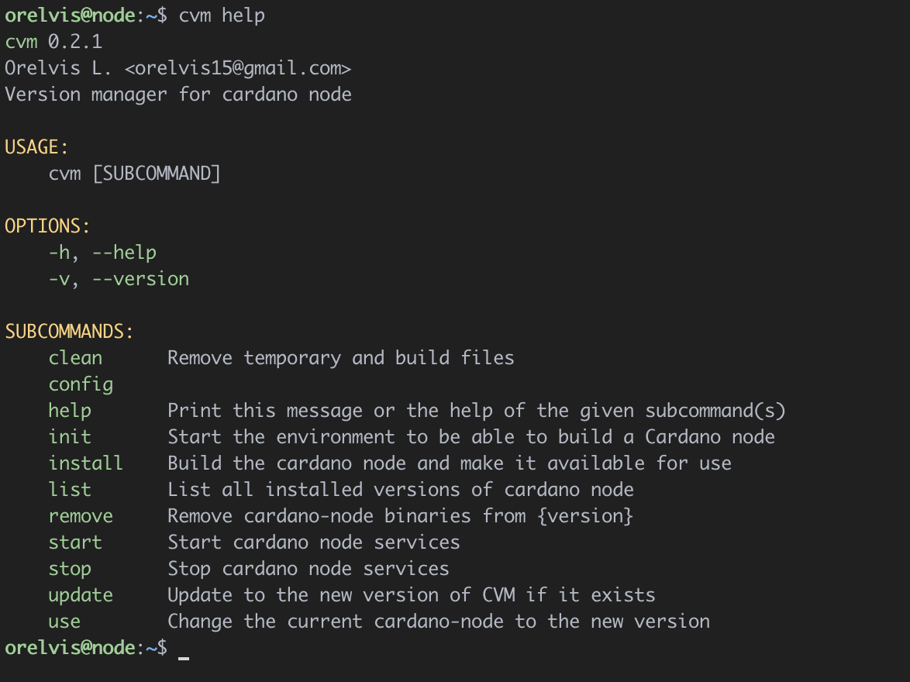
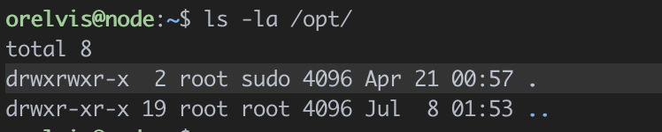
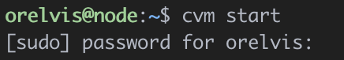

summary: Cardano Version Manager English
id: english
categories: cardano tool
tags: cardano, cvm
status: Published 
authors: Orelvis Lago Vasallo

# Cardano Version manager
<!-- ------------------------ -->
## Summary 
Duration: 1

### What are we going to learn
We are going to learn how to use Cardano Version Manager (CVM) to manage versions and configuration of cardano node executables.


<!-- ------------------------ -->


<!-- ------------------------ -->
## Installing CVM
Duration: 1

1 - To install cvm we just have to execute the following line in our terminal.

```
curl https://raw.githubusercontent.com/orelvis15/cvm/master/install.sh -sSf | bash && source "$HOME"/.cvm/env
```

2 - Once the execution is finished you should have an output like this


3 - Let's run ***cvm help*** to verify that the installation was successful.



### Congratulations!
Cardano Version Manager is now installed on your server.

<!-- ------------------------ -->


<!-- ------------------------ -->

## Initial settings for using CVM
Duration: 1

CVM creates the folder structure needed to start the cardano node in the /opt directory, we need to make sure that the current user has write permissions to this directory.

1 - We add the current user in the **sudo** group.

```
sudo adduser [user] sudo
```

Replace [user] with the user, in our case it would be **sudo adduser orelvis sudo**.

2 - We add the sudo group as owner of the /opt directory

```
sudo chown -R root:sudo /opt
```

3 - We assign read/write permissions to the user and group owners of the /opt directory

```
sudo chmod -R 775 /opt
```

We run ls -la and if all went well we should have an output like this.



### Congratulations!
You are all set to use CVM

<!-- ------------------------ -->


<!-- ------------------------ -->

## Preparing the server with CVM
Duration: 1

1 - To be able to use a cardano node we need to install certain dependencies and download several configuration files, we will be able to do all this with the **cvm init** command

```
cvm init
```

This command will do the following.
  - Install all the necessary dependencies to run and compile the cardano node.
  - Create the necessary folder structure in the /opt directory
  - Download the configuration files published by IOK.
  - Download the scripts published by the [guild-operator](https://github.com/cardano-community/guild-operators) community to manage our node.

2 - If all went well you should see an output like this.


### Congratulations!
Now the server is ready to use the cardano node.
<!-- ------------------------ -->


<!-- ------------------------ -->
## Compiling Cardano node
Duration: 1

The safest way to use cardano node binaries is if we compile it ourselves, there is the option recommended by the community, that's why this functionality is built into CVM.

In the last section we prepared our server to compile cardano node without problems.

1 - We run the command **cvm install x.x.x** where **x.x.x** is the cardano version we want to install, if we only want to install the latest version we can run **cvm install** and cvm will find the latest version version available.

```
cvm install
```

This command will perform the following actions.
- Clone the cardano node repository with the latest changes.
- Makes sure that it is in the tag of the version that was passed by parameters.
- Update Cabal packages.
- Compile the cardano node.
- Create a folder in /opt/cardano/bin with the name of the version that was installed and copy the generated binaries into it.


Once finished you should have something like this.


2 - If we now execute ***cvm list** we will see that we have an output similar to this.

```
cvm list
```


### Congratulations!
The cardano node is already installed on the server.

<!-- ------------------------ -->


<!-- ------------------------ -->
## Starting the node
Duration: 1

We already have node installed on our server, now we need to get it up and running.

1 - first we are going to run **cvm use x.x.x**.

```
cvm use 1.35.0
```

This command will do the following:
- Save as the version of cardano to execute the pass by parameters.
- In case the cardano service does not exist, it will be created
- It will restart the systemctl daemon to get the changes in the service

***This step requires administrator access, it is common to ask for the root password***

You should have an output like this


2 - If we now execute **cvm list** we should get an output similar to this.


3 - Verifiquemos que el sistema está reconociendo el nodo de cardano y la cardano cli.

```
cardano-node --version
```


```
cardano-clie --version
```


Now everything is ready to start with the synchronization of the node.

4 - We start the cardano node service

```
cvm start
```



5 - We check that the service is running

```
systemctl cnode status
```


### Congratulations!
Now you have the cardano node running on your server.
<!-- ------------------------ -->


<!-- ------------------------ -->
## Monitoring synchronization
Duration: 1

We can keep track of the synchronization with the ledger using the guild-operator community scripts

1 - We access the scripts directory in /opt/cardano.

```
cd /opt/cardano/scripts
```

2 - Now we run **gLiveView**

```
./gLiveView.sh
```

You should see something like this


<!-- ------------------------ -->

## Próximos Pasos 
Duration: 1

You can find more information about CVM on the [official page on github](https://github.com/orelvis15/cvm).


<!-- ------------------------ -->