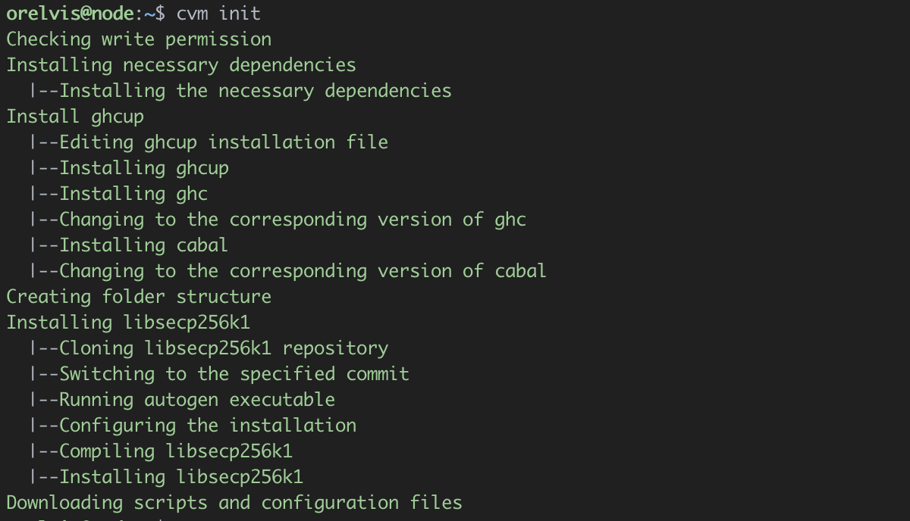

summary: Cardano Version Manager Espanol
id: spanish
categories: cardano tool
tags: cardano, cvm
status: Published 
authors: Orelvis Lago Vasallo

# Cardano Version manager
<!-- ------------------------ -->
## Sumario 
Duration: 1

### Que vamos a aprender 
Vamos a aprender a usar Cardano Version Manager (CVM) para administrar las versiones y configuración de los ejecutables del nodo de cardano.


<!-- ------------------------ -->


<!-- ------------------------ -->
## Instalando CVM
Duration: 1

1 - Para instalar cvm solo debemos ejecutar la siguiente línea en nuestra terminal.

```
curl https://raw.githubusercontent.com/orelvis15/cvm/master/install.sh -sSf | bash && source "$HOME"/.cvm/env
```

2 - Una vez terminada la ejecución se debería tener una salida como esta


3 - Ejecutemos ***cvm help*** para verificar que la instalación tuvo éxito.


### Felicitaciones!
Ya está instalado Cardano Version Manager en tu servidor.

<!-- ------------------------ -->


<!-- ------------------------ -->

## Ajustes iniciales para usar CVM
Duration: 1

CVM crea la estructura de carpetas necesarias para iniciar el nodo de cardano en el directorio /opt, debemos asegurarnos de que el usuario actual tenga los permisos de escritura en este directorio.

1 - Añadimos al usuario actual en el grupo de **sudo**.

```
sudo adduser [user] sudo
```

Remplace [user] por el usuario, en nuestro caso seria **sudo adduser orelvis sudo**.

2 - Añadimos el grupo sudo como propietario del directorio /opt

```
sudo chown -R root:sudo /opt
```

3 - Asignamos permisos de lectura/escritura al usuario y grupo propietarios del directorio /opt

```
sudo chmod -R 775 /opt
```

Ejecutamos ls -la y si todo salió bien deberíamos tener una salida como esta.


### Felicitaciones!
Ya está todo listo para usar CVM

<!-- ------------------------ -->


<!-- ------------------------ -->

## Preparando el servidor con CVM
Duration: 1

1 - Para poder utilizar un nodo de cardano necesitamos instalar ciertas dependencias y descargar varios archivos de configuración, todo esto lo vamos a poder hacer con el comando **cvm init**

```
cvm init
```

Este comando va a realizar lo siguiente.
 - Instalar todas las dependencias necesarias para correr y compilar el nodo de cardano.
 - Crear la estructura de carpetas necesarias en el directorio /opt
 - Descargar los archivos de configuración publicados por IOK.
 - Descargar los scripts publicados por la comunidad [guild-operator](https://github.com/cardano-community/guild-operators) para gestionar nuestro nodo.

2 - Si todo salió bien deberías ver una salida como esta.



### Felicitaciones!
Ahora el servidor está listo para usar el nodo de cardano.
<!-- ------------------------ -->


<!-- ------------------------ -->
## Compilando Cardano node
Duration: 1

La forma más segura de utilizar los binarios del nodo de cardano es si nosotros mismo lo compilamos, está la opción recomendada por la comunidad, por eso esta funcionalidad está integrada en CVM.

En la sección pasada preparamos nuestro el servidor para compilar cardano node sin problemas.

1 - Corremos el comando **cvm install x.x.x** donde **x.x.x** es la versión de cardano que queremos instalar, si solo queremos instalar la última versión podemos ejecutar **cvm install** y cvm se encargará de encontrar la última versión disponible.

```
cvm install
```

Este comando va a realizar las siguientes acciones.
- Clona el repositorio del nodo de cardano con los últimos cambio.
- Se asegura de que se encuentre en la etiqueta de la versión que se pasó por parámetros.
- Actualiza los paquetes de Cabal.
- Compila el nodo de cardano.
- Crea una carpeta en /opt/cardano/bin con el nombre de la versión que se instaló y copia dentro los binarios generados.


Una vez terminado debería tener algo como esto.


2 - Si ahora ejecutamos ***cvm list** veremos que tenemos una salida parecida a esta.

```
cvm list
```


### Felicitaciones!
Ya está instalado el nodo de cardano en el servidor.

<!-- ------------------------ -->


<!-- ------------------------ -->
## Iniciando el nodo
Duration: 1

Ya tenemos el nodo instalado en nuestro servidor, ahora necesitamos hacer que comience a funcionar.

1 - primero vamos a ejecutar **cvm use x.x.x**.

```
cvm use 1.35.0
```

Este comando va a hacer lo siguiente:
- Guarda como la versión de cardano a ejecutar la pasada por parámetros.
- En caso de que no exista el servicio de cardano este se va a crear
- Va a reiniciar el demonio de systemctl para obtener los cambios en el servicio

***En este paso se necesita acceso de administrado, es común que se pida la contraseña de root***

Deberías tener una salida como esta


2 - Si ahora ejecutamos **cvm list** deberíamos obtener una salida parecida a esta.


3 - Verifiquemos que el sistema está reconociendo el nodo de cardano y la cardano cli.

```
cardano-node --version
```


```
cardano-clie --version
```


Ya todo está listo para comenzar con la sincronización del nodo.

4 - Iniciamos el servicio del nodo de cardano

```
cvm start
```


5 - Chequeamos que el servicio esté corriendo

```
systemctl cnode status
```


### Felicitaciones!
Hora tienes el nodo de cardano corriendo en tu servidor.
<!-- ------------------------ -->


<!-- ------------------------ -->
## Monitorizando la sincronización
Duration: 1

Podemos hacer seguimiento de la sincronización con el libro mayor usando los scripts de la comunidad de guild-operator

1 - Accedemos al directorio de scripts en /opt/cardano.

```
cd /opt/cardano/scripts
```

2 - Ahora corremos **gLiveView**

```
./gLiveView.sh
```

Deberías ver algo como esto


<!-- ------------------------ -->

## Próximos Pasos 
Duration: 1

Puedes encontrar más información sobre CVM en la [página oficial en github](https://github.com/orelvis15/cvm).


<!-- ------------------------ -->